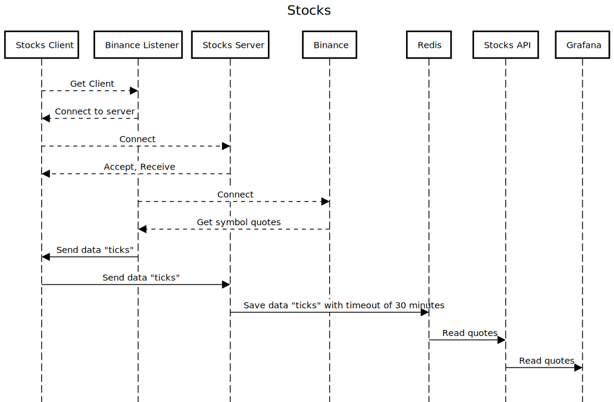
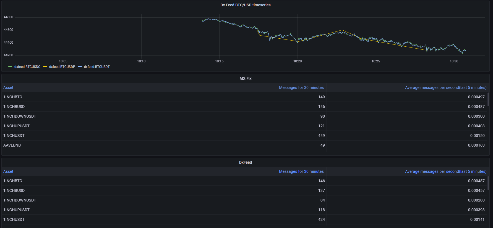

# Stocks

## Requirements
* [Python 3.8](https://www.python.org/downloads/release/python-380/)
* [Poetry](https://python-poetry.org/)
* [Docker](https://www.docker.com/)

### Optional
* [Redis](https://redis.io/)
* [Grafana](https://grafana.com/)

## Description

The service consists of following components:
* Redis
* Stocks server
* Binance listener
* Stocks client
* Stocks API
* Grafana

It uses [Binance](https://www.binance.com/en/) WebSocket API
to produce "ticks".Information is sent
There are other 2 components that use sockets: server and client.
Server connects with client and creates server client. It is, then,
provided for binance listener to send ticks.
Client receives them and writes to Redis with 30 minutes timeout.
Grafana connects to Stocks API, reads data and renders graphs.




>Note: binance listener could be turned off.
>Serve, API and Grafana could be used without
>them when another client used for data.


## Service launch and test
Run following depending on your OS.
For Linux systems use files with "sh" postfix, like ```format.sh```,
for Windows use cmd-files - ```start.cmd```.

**Preferable scripts launch sequence**
1. format
2. start
5. stop

### Scripts

**CAUTION!: check scripts before running them**

* to format
   ```console
   ./scripts/format.sh(.cmd)
   ```
* to start
   ```console
   ./scripts/start.sh(.cmd)
   ```
* to stop
   ```console
   ./scripts/stop.sh(.cmd)
   ```

## Running service URLs

### Grafana
* main page <http://127.0.0.1:3333/>
* created dashboard <http://127.0.0.1:3333/d/5mDmBBInk/stocks?orgId=1&refresh=1m>

### Documentation
* Swagger <http://127.0.0.1:8000/docs#>
* ReDoc <http://127.0.0.1:8000/redoc#>
